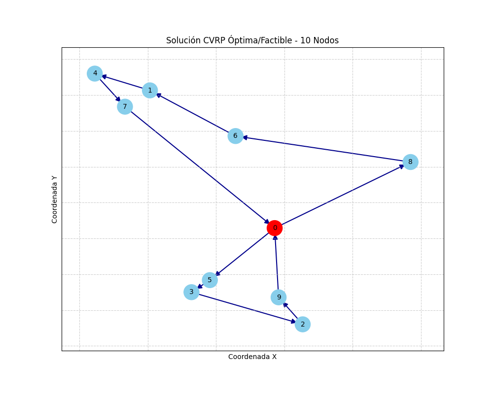
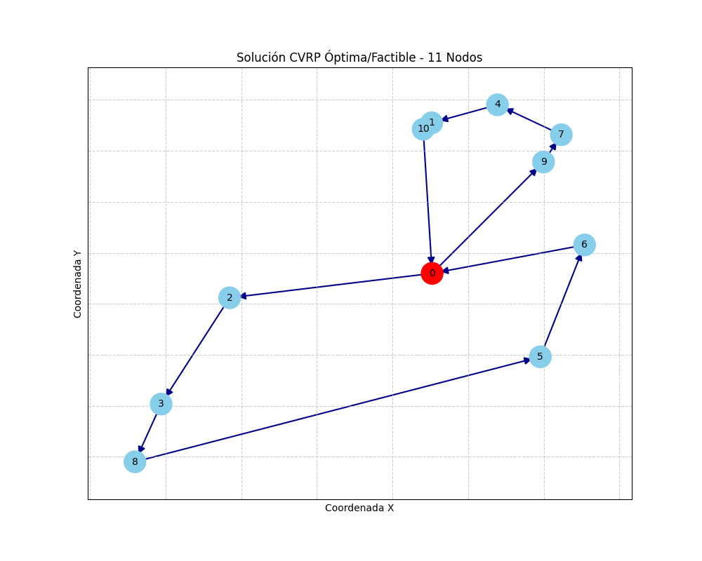
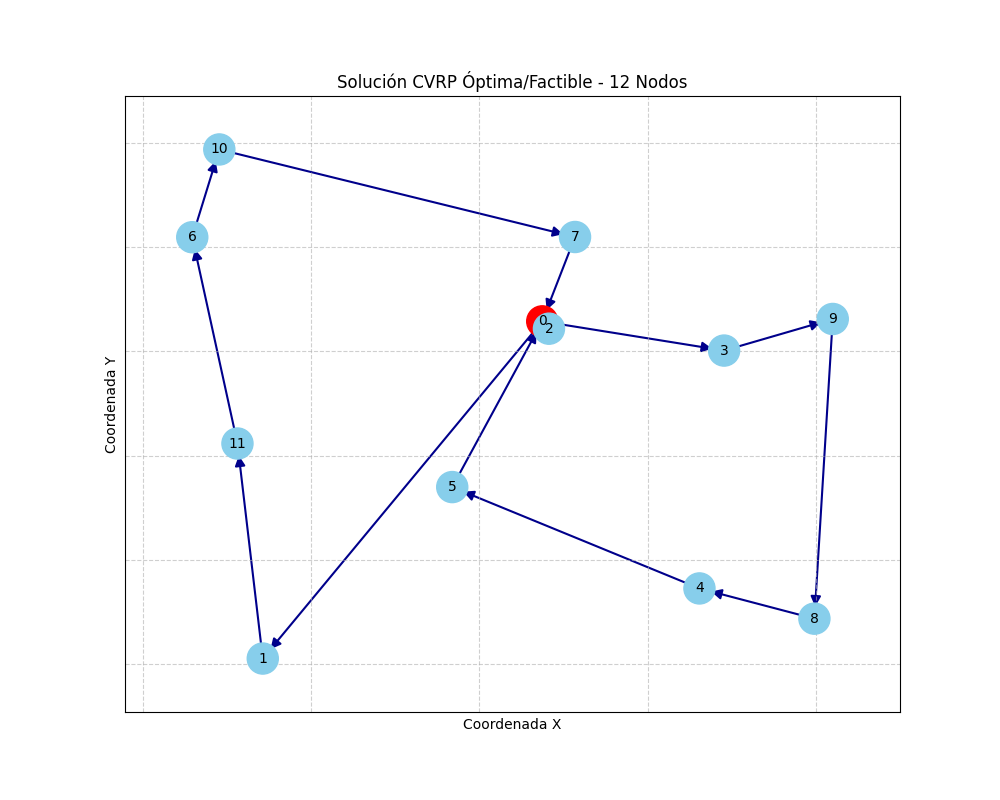
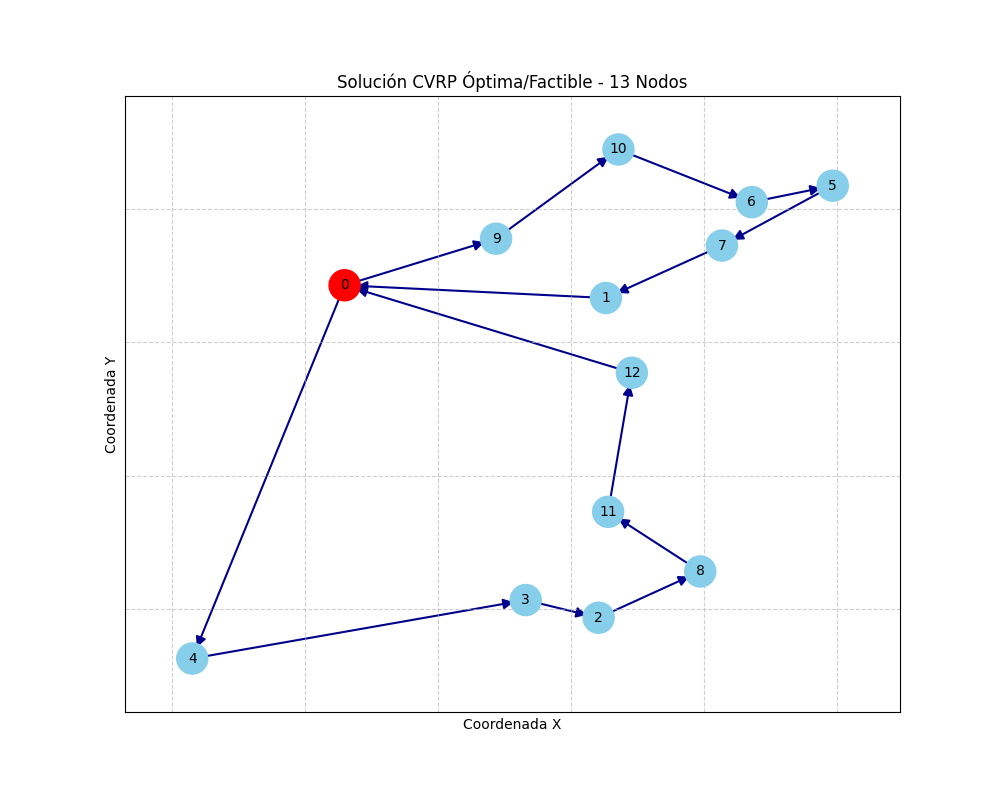
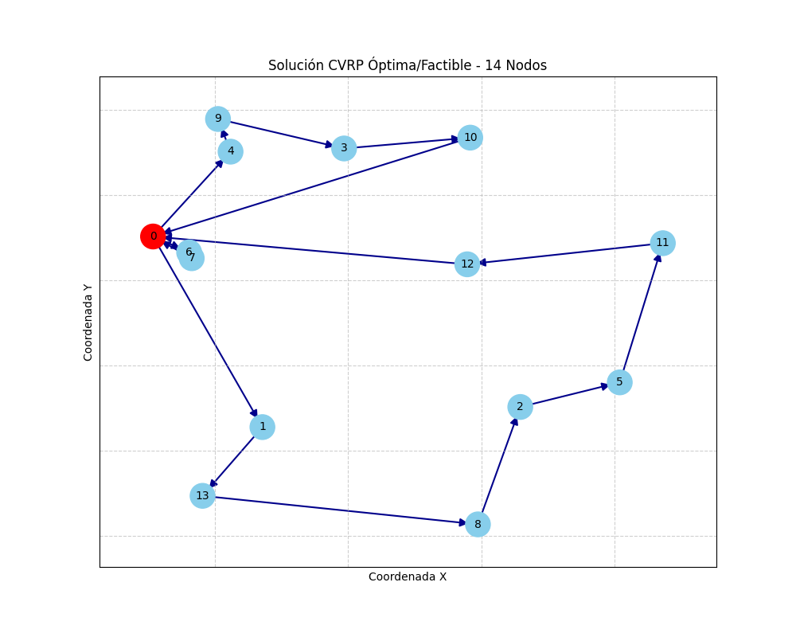
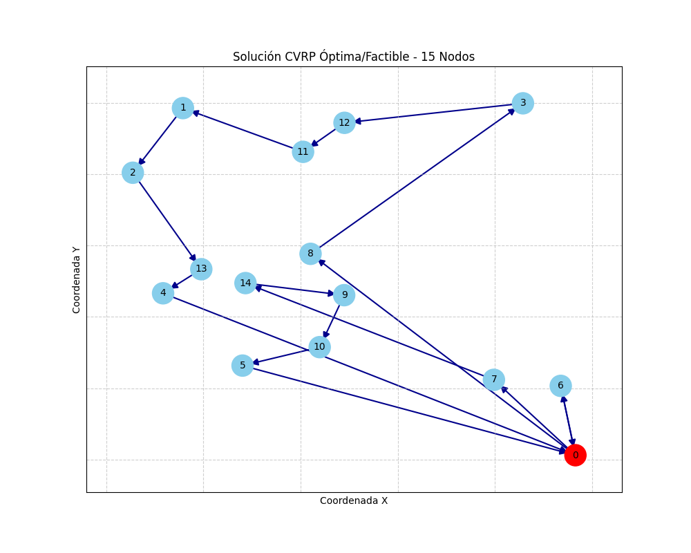
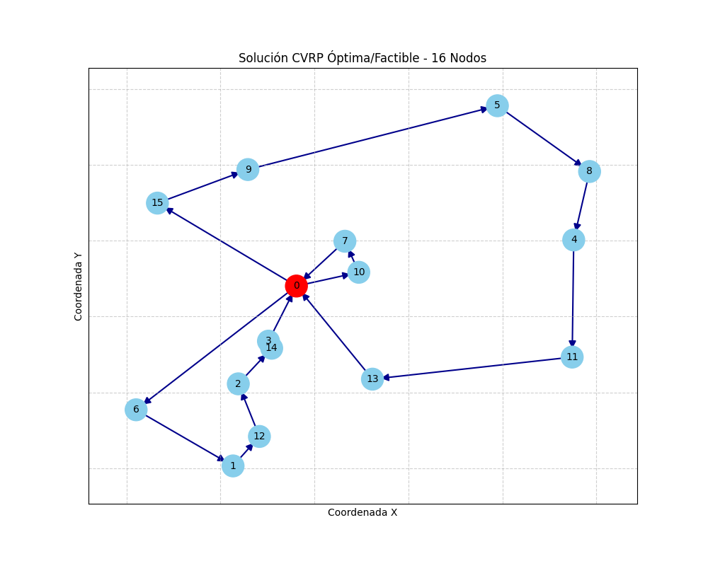
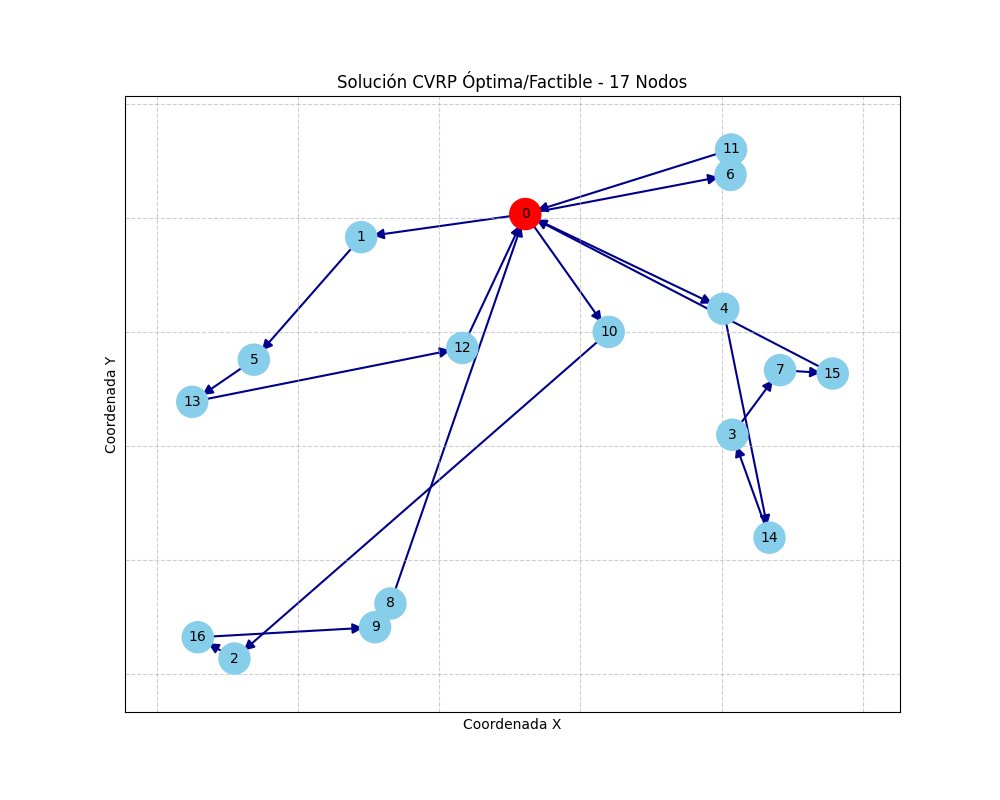
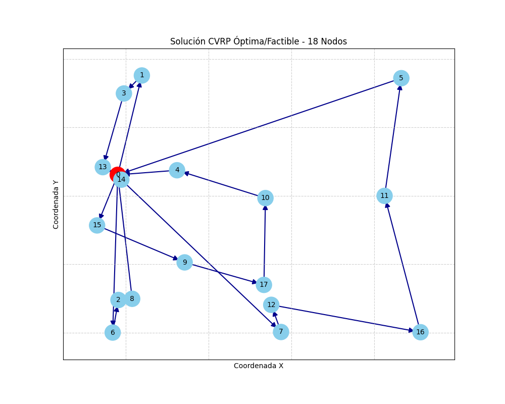
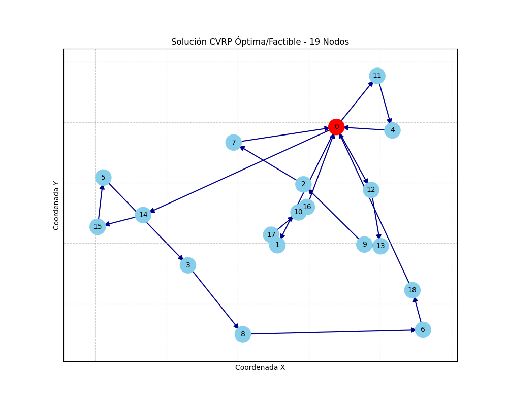

# CVRP Solver - Proyecto de Optimización Logística

Este documento describe la resolución y análisis del **Problema de Rutas de Vehículos con Capacidad (CVRP)**, una extensión fundamental del Problema del Viajante de Comercio (TSP) aplicada a la logística industrial.

---

## 1. El Proyecto (Contexto, Objetivo y Resultados)

El proyecto se desarrolla a través de tres componentes clave que definen su propósito:

a.  **Fundamentación Logística**: El problema CVRP consiste en planificar una serie de rutas de entrega que parten de un depósito central para visitar a un conjunto de clientes y satisfacer su demanda, regresando al punto de origen sin exceder la capacidad máxima de cada vehículo y minimizando la distancia total.
b.  **Objetivo del Experimento**: El fin principal es realizar un **Análisis de Escalabilidad**. Se busca identificar el "techo computacional" del solver al incrementar de forma sucesiva el número de clientes (desde 10 hasta 50), observando cómo el tiempo de resolución crece de forma no lineal (NP-Hard).
c.  **Visualización y Evidencia**: No solo se busca una respuesta numérica; el proyecto genera evidencia visual de cada solución factible, permitiendo verificar que las rutas sean lógicas y que cada nodo sea visitado mediante una gestión eficiente del flujo de carga.

---

## 2. El Escenario de Datos (Casos Ficticios)

Para este estudio se generan datos sintéticos que representan un escenario de distribución urbana estándar:

a.  **Malla Geográfica**: Se utiliza un plano cartesiano de 100x100 unidades de distancia donde los nodos (clientes) aparecen de forma aleatoria.
b.  **El Depósito (Nodo 0)**: Se establece una coordenada central aleatoria que sirve como inicio y fin obligatorio para todos los vehículos. Su demanda es siempre cero.
c.  **Capacidad de Flota**: Cada vehículo posee una capacidad fija de **100 unidades**.
d.  **Demandas de Clientes**: Cada cliente (`id: i`) requiere una carga aleatoria entre **1 y 33 unidades**, lo que obliga a la flota a realizar varias rutas separadas cuando la demanda total acumulada de un conjunto de clientes supera las 100 unidades.

---

## 3. Metodologías y Tecnologías Aplicadas

La resolución de este caso se basa en técnicas de investigación de operaciones avanzadas:

a.  **Programación Lineal Entera Mixta (MIP)**: Se define el problema mediante variables binarias para decidir recorridos y variables continuas para gestionar la carga acumulada.
b.  **Formulación Miller-Tucker-Zemlin (MTZ)**: Es la metodología usada para la **eliminación de subtours**. Esta técnica garantiza matemáticamente que los vehículos no formen "mini-ciclos" cerrados entre clientes sin pasar primero por el depósito.
c.  **Optimización bajo PuLP/CBC**: Se utiliza el lenguaje de modelado PuLP y el motor de optimización CBC para encontrar la solución óptima del modelo planteado.
d.  **Graficación por Capas (NetworkX/Matplotlib)**: Una metodología de representación de grafos direccionados para superponer las rutas óptimas sobre las coordenadas geográficas de los clientes.

---

## 4. Arquitectura e Implementación del Código

El script `cvrp_solver.py` se organiza en cuatro funciones críticas que operan en flujo secuencial:

a.  **Generación de Vectores (`generate_cvrp_data`)
-   Implementa la lógica de generación aleatoria reproducible mediante semillas (`seed`).
-   Calcula la **Matriz de Distancias Euclidiana** para que el modelo conozca el costo de viajar de cualquier nodo A al B.

b.  **El Núcleo de Modelado (`solve_cvrp_iteration`)
-   **Variables**:
    -   `x_ij`: 1 si se viaja de `i` a `j`, 0 de lo contrario.
    -   `u_i`: Nivel de carga acumulada al llegar al cliente `i`.
-   **Restricciones de flujo**: Garantizan que entra un vehículo y sale un vehículo por cada cliente.
-   **Restricciones de capacidad**: Impiden que la variable `u_i` supere las 100 unidades.

c.  **Renderizado de Solución (`draw_cvrp_solution`)
-   Extrae las variables `x_ij` activas y crea un objeto `nx.DiGraph`.
-   Diferencia visualmente el depósito (rojo) de los clientes (azul cielo) y dibuja flechas de dirección para las rutas.

d.  **Orquestador Principal (`main`)
-   Ejecuta el bucle incremental. Incrementa el número de nodos (`num_nodes`) y registra los tiempos de ejecución. Detiene el proceso automáticamente cuando se detecta un tiempo excesivo o una solución no encontrada.

---

## 🚀 Guía Rápida de Instalación

```powershell
# 1. Preparar entorno
python -m venv venv
Set-ExecutionPolicy -ExecutionPolicy Bypass -Scope Process
.\venv\Scripts\activate

# 2. Instalar dependencias
pip install -r requirements.txt

# 3. Correr experimento
python cvrp_solver.py
```

---

## 📊 Galería de Resultados del Último Experimento

A continuación se muestra el comportamiento observado durante el análisis:

| Nodos | Tiempo (seg) | Estado |
|-------|--------------|--------|
| 10 | 3.47 | Factible |
| 11 | 4.43 | Factible |
| 12 | 4.81 | Factible |
| 13 | 60.11 | Factible |
| 14 | 56.97 | Factible |
| 15 | 60.21 | Factible |
| 16 | 47.03 | Factible |
| 17 | 59.91 | Factible |
| 18 | 59.93 | Factible |
| 19 | 1459.58 | No encontrada |











